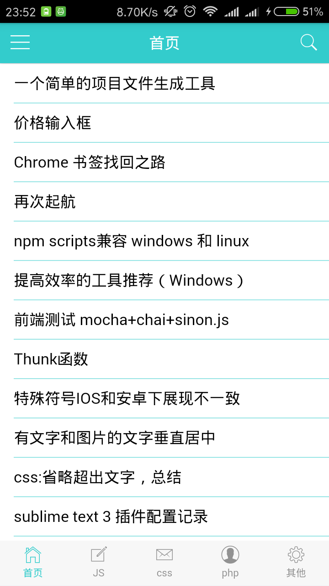
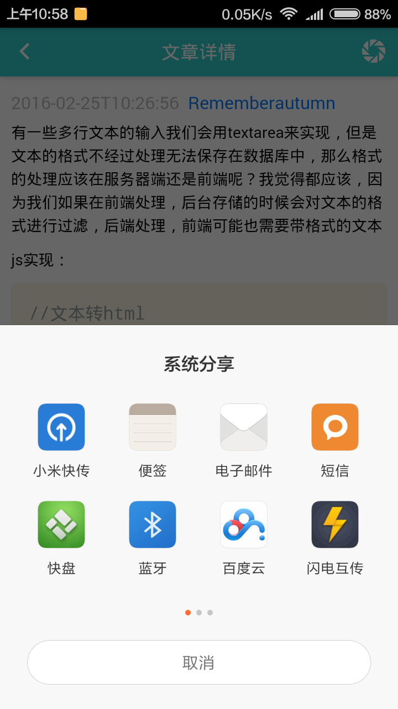
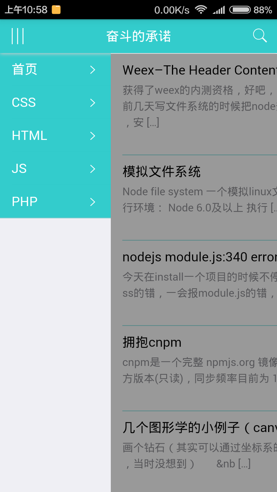
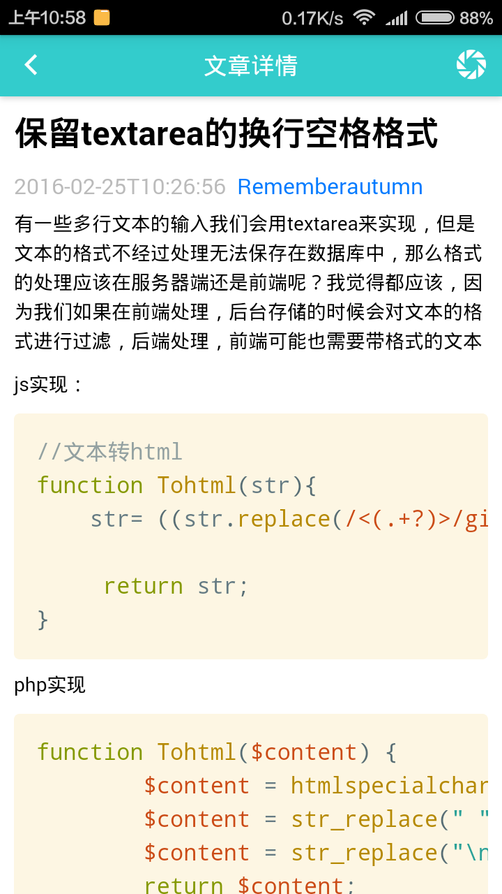
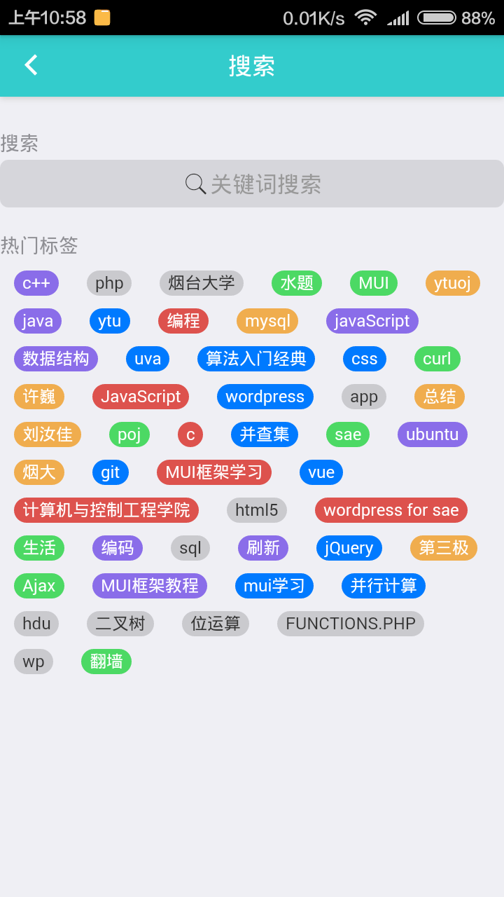

# Wordpress-Mobile-Application
利用`wordpress`作为后台，构建`App`(安卓和IOS)
-------------------
### 更新内容


2017.6.26: 文章列表页增加截图,兼容4.8

2016.10.24: 添加底部菜单栏

2016.10.02: 升级 vue 2.0 版本
2016.05.15：支持代码高亮，支持语言PHP,JS,CSS,Java等，代码格式`<pre class="lang:js">code</pre>`或`<pre class="lang:js"><code>code<code></pre>`,代码高亮使用了prismjs，做了一些修改，如有其它需求可修改此插件。

### 定制 APP

#### 修改主题颜色

下载本项目代码，打开css/mystyle.css最后几行有注释声明可以修改颜色值，修改颜色值即可自定义主题颜色。

#### 修改底部菜单

在`/js/app.js` 中修改 `nav_bar` 数据可以修改底部菜单栏，其中 `class` 为图标样式，可选样式参考 [所有图标](http://dev.dcloud.net.cn/mui/ui/#icon)

-----------------------
### 构建方法
1. 安装`wordpress`

2. 为`wordpress`安装 `wordpress rest api` （2.0版本及以上）

3. 更改`/js/app.js`里面的`name`和菜单名称和对应的`id`（可在`example.com/wp-json/wp/v2/categories`查看）

4. 下载安装`Hbuilder`，使用其在线打包功能，选择文件/打开目录（打开本项目代码目录），双击`manifest.json`设置`app`名称和`id`，修改`app`图标和启动图。

5. 点击发行，发行为原生应用，设置好开发者证书，然后打包。

打包成功后会自动下载到本地目录，这样一个`App`就制作好了。

### 列表页增加图片

当前主题的`functions.php`下添加如下代码即可

```php
// 添加缩略图
add_action( 'rest_api_init', 'add_thumbnail_to_JSON' );
function add_thumbnail_to_JSON() {
//Add featured image
register_rest_field( 'post',
    'featured_image_src', //NAME OF THE NEW FIELD TO BE ADDED - you can call this anything
    array(
        'get_callback'    => 'get_image_src',
        'update_callback' => null,
        'schema'          => null,
         )
    );
}

// 自动缩略图
function get_image_src( $object, $field_name, $request ) {
  $first_img = '';
  $output = preg_match_all('//i', $object['content']['rendered'], $matches);
  $first_img = $matches [1] [0];

  if(empty($first_img)){
    // echo get_bloginfo ( 'stylesheet_directory' );
    // echo '/img/default.jpg';
    $first_img = 'https://wx2.sinaimg.cn/crop.0.60.600.450.240/bc1249d0gy1fpcnyjbd38j20go0go0ta.jpg';
  }
    return $first_img;
}
```


### 案例体验
我的博客：[奋斗的承诺](https://github.com/4013465w/Wordpress-Mobile-Application/blob/master/unpackage/release/myblog_0331140049.apk?raw=true)

### 用到的技术
1. html5+:[http://www.html5plus.org/doc/h5p.html](http://www.html5plus.org/doc/h5p.html)

2. mui:[http://dev.dcloud.net.cn/mui/](http://dev.dcloud.net.cn/mui/)

3. hbuilder:[http://www.dcloud.io/](http://www.dcloud.io/)

### 项目截图

    
   

## 分享交流

打赏|加小助手进微信群
:---:|:---:
  |  

##License

The MIT License (MIT)

Copyright (c) 2016 Zhen.Wang
